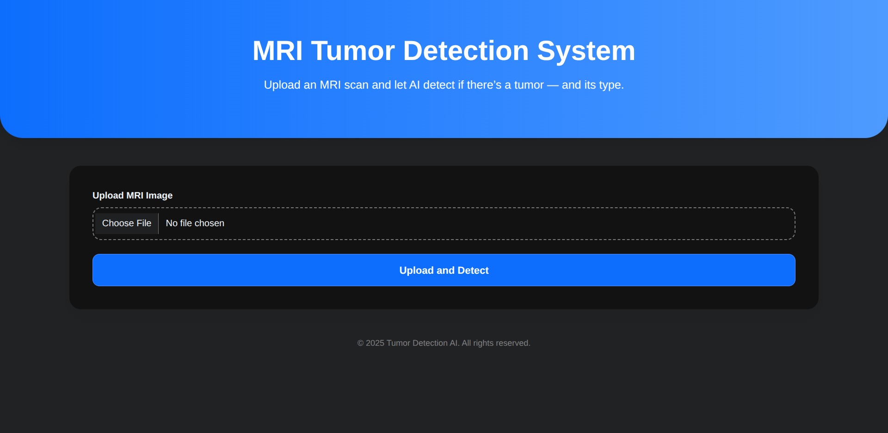
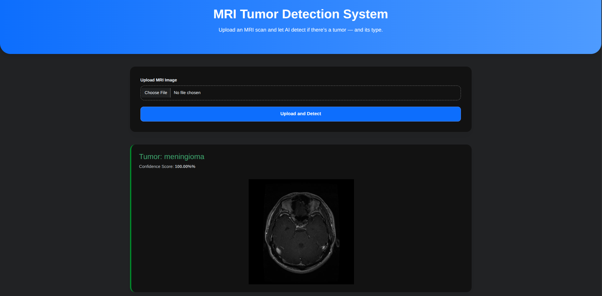
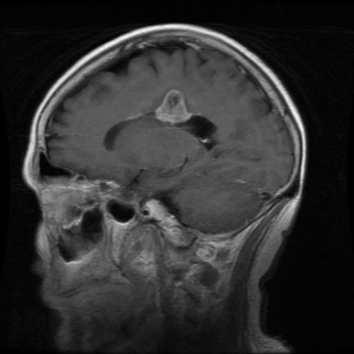

# Brain Tumor Classification using VGG16

## Overview

This project implements a brain tumor classification system using a convolutional neural network based on the VGG16 architecture. The objective is to accurately identify whether an MRI scan indicates the presence of a brain tumor. The model is trained and evaluated using a curated dataset of MRI images, and a web interface is provided to allow users to upload images and receive predictions.

## Features

- Utilizes pre-trained VGG16 model with transfer learning
- High-accuracy classification of brain MRI scans
- End-to-end pipeline: preprocessing, model training, evaluation
- Web-based interface for image upload and prediction
- Visualization of model performance and predictions

## Screenshots

### 1. Web Interface – Before Image Upload  


### 2. Web Interface – After Image Upload with Prediction Result  


### 3. Sample MRI Image Used for Model Evaluation  


## Installation Instructions

```bash
# 1. Clone the repository
git clone https://github.com/yourusername/brain_tumor_classification.git
cd brain_tumor_classification

# 2. Create and activate a virtual environment
python -m venv venv
source venv/bin/activate  # On Windows: venv\Scripts\activate

# 3. Install dependencies
pip install -r requirements.txt

# 4. Run the Flask app
python app.py
```

## Usage

- Open a browser and go to `http://127.0.0.1:5000/` after starting the server.
- Upload an MRI scan image using the interface.
- The application will classify the image and display the prediction result.
- All uploaded images are stored in the `upload/` directory for review.

### Model Training (Jupyter Notebook)

The training notebook `brain_tumour_detection_using_deep_learning.ipynb`:
- Loads and preprocesses MRI images
- Applies data augmentation
- Uses VGG16 with custom classifier head
- Evaluates model using metrics and confusion matrix
- Saves trained model to `models/model.h5`

## Technologies Used

- Python
- TensorFlow / Keras (VGG16)
- Flask (for web interface)
- OpenCV, NumPy, Matplotlib
- Jupyter Notebook

## Folder Structure

```
brain_tumor_classification/
│
├── app.py                                  # Flask web application
├── brain_tumour_detection_using_deep_learning.ipynb  # Model training and evaluation
├── requirements.txt                        # Required Python packages
├── README.md                               # Project documentation
│
├── models/
│   └── model.h5                            # Trained VGG16-based model
│
├── sample_MRI_image/
│   └── Te-gl_0011.png
│   └── Te-gl_0012.png
│   └── Te-gl_0013.png                            
│
├── upload/
│   └── [user_uploaded_images].jpg         # Uploaded images via web app
│
├── templates/
│   └── index.html                          # HTML template for web interface
│
├── images/
    └── [visual assets].png                 # Screenshots and plots
```
